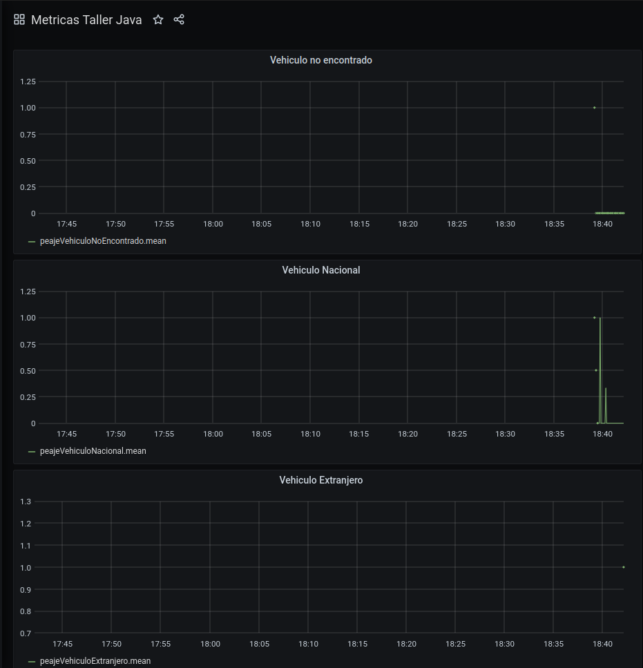
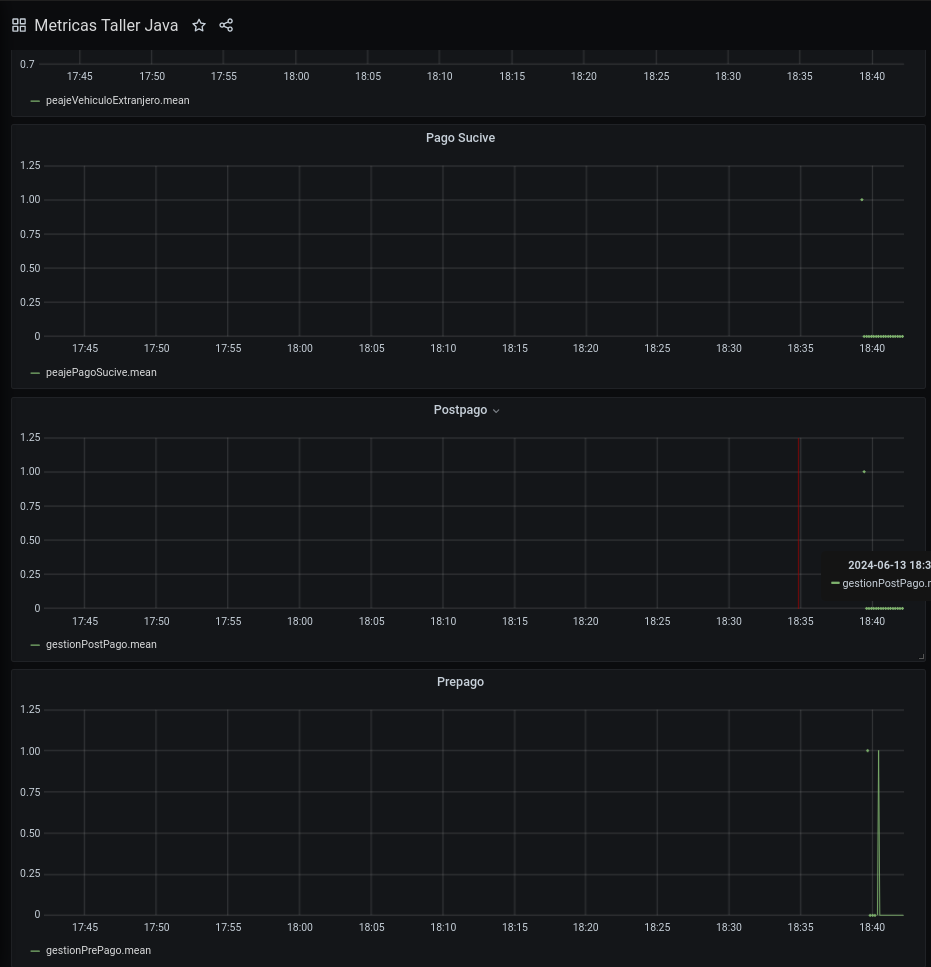

La aplicación consta de 6 módulos y se centra en la pasada de vehiculos por peaje

Comienza en el modulo peaje cuando pasa un vehiculo
este verifica el tag y de poseer, se comunica con el modulo gestion de usuarios para intentar realizar PREpago o PostPago.
De ser postpago este debe comunicarse con el módulo medios de pago.
Si es nacional y no posee tag o no fueron posibles estos medios de pago,
se comunica con el modulo sucive para registrar el pago por matricula

Los casos de uso principales están representados en el archivo CasosDeUsoTest

**********************************************************************************

Activar o desactivar RateLimiter:

GET: http://localhost:8080/TallerJava/api/config/activarRateLimiter?valor=true

**********************************************************************************

Modulo Peaje:

GET: http://localhost:8080/TallerJava/api/peaje/vehiculos/{matricula}

POST: http://localhost:8080/TallerJava/api/peaje/tarifaPreferencial

POST: http://localhost:8080/TallerJava/api/peaje/tarifaComun

********************************************************************

Modulo Pago:

POST: http://localhost:8080/TallerJava/api/mediosDePago/altaCliente
{
    "usuario": {
        "ci": "12345678",
        "nombre": "Usuario Ejemplo",
        "email": "usuario@example.com",
        "vinculosVehiculos": []
    },
    "tarjeta": {
        "nro": 1234,
        "nombre": "Usuario Ejemplo",
        "fechaVto": "2025-12-31"
    }
}

POST: http://localhost:8080/TallerJava/api/mediosDePago/notificarPago/12345678/tag123/100.50/1234

GET: http://localhost:8080/TallerJava/api/mediosDePago/consultarPagosPorDia/2024-05-27/2024-05-30

GET: http://localhost:8080/TallerJava/api/mediosDePago/consultarPagosPorCliente/12345678

GET: http://localhost:8080/TallerJava/api/mediosDePago/consultarPagosClienteVehiculo/12345678/tag123

********************************************************************

Modulo Gestion:

add ususuario
POST http://localhost:8080/TallerJava/api/usuarios/
{
        "ci":"CI1",
        "email":"EMAIL1",
        "nombre":"name1",
        "password":"passnuevo"
}

add vehiculo a usuario
POST http://localhost:8080/TallerJava/api/usuarios/CI1/vehiculos/
{
    "tag":"tag2",
    "extranjero":true,
    "matricula":"mat1"
}

mostrar vehiculos vinculados
GET http://localhost:8080/TallerJava/api/usuarios/CI1/vehiculos

info usuario
GET http://localhost:8080/TallerJava/api/usuarios/CI1

cargar saldo
POST http://localhost:8080/TallerJava/api/usuarios/CI1/saldo
100.5 //va el numero solo en el body

realizar prepago
POST http://localhost:8080/TallerJava/api/usuarios/tag2/realizarPrePago
100.5 //va el numero solo en el body 

asociar tarjeta  pe
POST http://localhost:8080/TallerJava/api/usuarios/CI1/tarjeta
{
    "nro":110000,
    "nombre":"Nombre tarjeta",
    "fechaVto":"2024-12-10"
}

realizar postpago
POST http://localhost:8080/TallerJava/api/usuarios/tag2/realizarPostPago
100.5 //va el numero solo en el body 

desvincular vehiculo
DELETE http://localhost:8080/TallerJava/api/usuarios/vehiculos/tag2

Obtener pasadas por peaje
GET http://localhost:8080/TallerJava/api/usuarios/CI1/pasadas
{
    "fechaInicio": "2023-01-01",
    "fechaFin": "2023-12-31"
}

Obtener pasadas por peaje vehiculo
GET http://localhost:8080/TallerJava/api/usuarios/CI1/pasadas/tag2
{
    "fechaInicio": "2023-01-01",
    "fechaFin": "2023-12-31"
}

********************************************************************

Sucive Soap simulacion:

Ejecutar servidor en la api externa SOAPSucive
En el proyecto, en la direccion target/bin -> /wsconsume.sh -k http://localhost:8080/021-JakartaEE-XML/PagoSOAP?wsdl
Ejecutar el test en el moduloSucive
mvn test -Dtest=org.tallerjava.unitarios.moduloSucive.SuciveSoapMock#realizarPago

********************************************************************
Notificar Pago tarjeta Rest simulacion:

Endpoint para módulo externo de pago RESTFul: 
tarjeta válida: 111111111
tarjeta inválida: 222222222
tarjeta bloqueada: 333333333

Cualquier otra tarjeta es randómico de 5:1 los pagos realizados.

curl -X POST "http://localhost:8080/TallerJava/api/mockMediosDePago/notificarPago/111111111" -H "Content-Type: application/json"

curl -X POST "http://localhost:8080/TallerJava/api/mockMediosDePago/notificarPago/222222222" -H "Content-Type: application/json"

curl -X POST "http://localhost:8080/TallerJava/api/mockMediosDePago/notificarPago/333333333" -H "Content-Type: application/json"

curl -X POST "http://localhost:8080/TallerJava/api/mockMediosDePago/notificarPago/123456789" -H "Content-Type: application/json"

